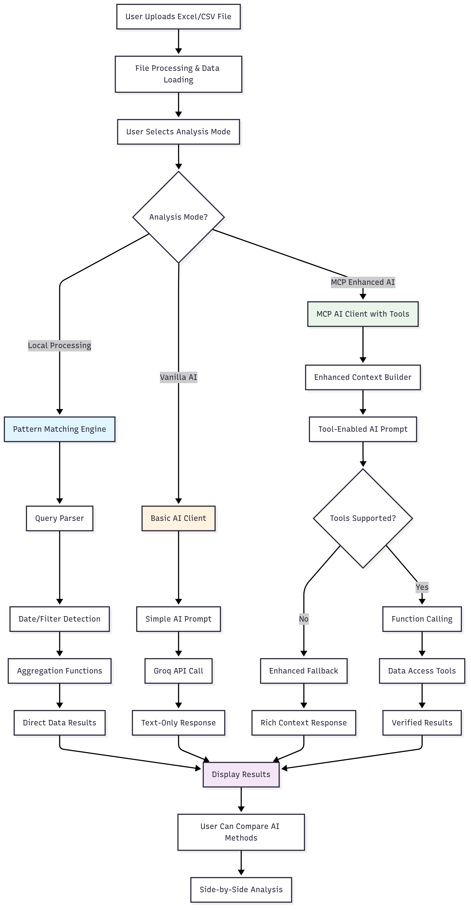

# 📊 Excel Reading Agent - AI Data Analysis

🚀 **Live Demo**: https://andrew-infosys-excelreaderdemo-app-vgw4w6.streamlit.app/

## 📋 System Architecture


*File structure and component relationships*

  
*Data processing flow and analysis modes*

## 🛠️ Installation

### Windows
```cmd
# Clone and setup
git clone https://github.com/andrew-infosys/excelreaderdemo.git
cd excelreaderdemo

# Create virtual environment
python -m venv venv
venv\Scripts\activate

# Install dependencies
pip install -r requirements.txt

# Create .env file (optional)
echo GROQ_API_KEY=your_key_here > .env

# Run app
streamlit run app.py
```

### macOS/Linux
```bash
# Clone and setup
git clone https://github.com/andrew-infosys/excelreaderdemo.git
cd excelreaderdemo

# Create virtual environment
python -m venv venv
source venv/bin/activate

# Install dependencies
pip install -r requirements.txt

# Create .env file (optional)
echo "GROQ_API_KEY=your_key_here" > .env

# Run app
streamlit run app.py
```

## 🎯 Features

- **3 Analysis Modes**: Local Processing, Vanilla AI, MCP Enhanced AI
- **Natural Language Queries**: "what is expenses on jan 3rd of 2015?"
- **Smart Date Parsing**: Understands various date formats
- **Real-time AI Comparison**: Side-by-side analysis
- **FREE API Support**: Groq integration with free tier

## 🔑 Get Free API Key

Visit [console.groq.com/keys](https://console.groq.com/keys) for a free Groq API key.

## 📁 File Structure

```
├── app.py              # Main Streamlit app
├── ai_clients.py       # AI processing (Vanilla & MCP)
├── query_processor.py  # Local pattern matching
├── ui_components.py    # UI components
├── env_config.py       # Environment config
└── requirements.txt    # Dependencies
```
